# 🚀 30 Days of JavaScript - LeetCode Challenge

<div align="center">


### 📊 JavaScript Fundamentals & Problem Solving

**Master JavaScript Through Daily Challenges**

[⭐ Star this Repo](https://github.com/ranichandnirani/30-Days-of-JS-Challenge) • [🍴 Fork It](https://github.com/ranichandnirani/30-Days-of-JS-Challenge/fork) • [📝 LeetCode Plan](https://leetcode.com/studyplan/30-days-of-javascript/)

</div>

---

## 📌 About This Repository

This repository contains my solutions to **LeetCode's 30 Days of JavaScript** study plan. This challenge covers essential JavaScript concepts including closures, promises, async programming, array methods, and Object-Oriented Programming.

**What's Inside:**

- ✅ All 30 problems solved with clean, efficient solutions
- 📝 Detailed explanations and approaches
- 🎯 Multiple solution methods where applicable
- 💡 Time and space complexity analysis
- 🔗 Links to LeetCode problems


## 📊 Progress Tracker

<div align="center">

### 🎯 TOTAL SOLVED: **30 / 30** | PROGRESS: **100%** ✅

</div>

| Day | Problem Name | Difficulty | Solution | LeetCode Link | Status |
|-----|--------------|------------|----------|---------------|--------|
| 001 | Create Hello World Function | 🟢 Easy | [**📝 Solution**](./Day-001/2667_Create-Hello-World-Function.js) | [**🔗 Problem**](https://leetcode.com/problems/create-hello-world-function/) | ✅ |
| 002 | Counter | 🟢 Easy | [**📝 Solution**](./Day-002/2620_counter.js) | [**🔗 Problem**](https://leetcode.com/problems/counter/) | ✅ |
| 003 | To Be Or Not To Be | 🟢 Easy | [**📝 Solution**](./Day-003/2704_To-Be-Or-Not-To-Be.js) | [**🔗 Problem**](https://leetcode.com/problems/to-be-or-not-to-be/) | ✅ |
| 004 | Counter II | 🟢 Easy | [**📝 Solution**](./Day-004/2665_counter2.js) | [**🔗 Problem**](https://leetcode.com/problems/counter-ii/) | ✅ |
| 005 | Apply Transform Over Each Element in Array | 🟢 Easy | [**📝 Solution**](./Day-005/2635_Apply-Transform-Over-Each-Element-in-Array.js) | [**🔗 Problem**](https://leetcode.com/problems/apply-transform-over-each-element-in-array/) | ✅ |
| 006 | Filter Elements from Array | 🟢 Easy | [**📝 Solution**](./Day-006/2634_Filter-Elements-from-Array.js) | [**🔗 Problem**](https://leetcode.com/problems/filter-elements-from-array/) | ✅ |
| 007 | Array Reduce Transformation | 🟢 Easy | [**📝 Solution**](./Day-007/2626_Array-Reduce-Transformation.js) | [**🔗 Problem**](https://leetcode.com/problems/array-reduce-transformation/) | ✅ |
| 008 | Function Composition | 🟢 Easy | [**📝 Solution**](./Day-008/2629_Function-Composition.js) | [**🔗 Problem**](https://leetcode.com/problems/function-composition/) | ✅ |
| 009 | Return Length of Arguments Passed | 🟢 Easy | [**📝 Solution**](./Day-009/2703_Return-Length-of-Arguments-Passed.js) | [**🔗 Problem**](https://leetcode.com/problems/return-length-of-arguments-passed/) | ✅ |
| 010 | Allow One Function Call | 🟢 Easy | [**📝 Solution**](./Day-010/2666_Allow-One-Function-Call.js) | [**🔗 Problem**](https://leetcode.com/problems/allow-one-function-call/) | ✅ |
| 011 | Memoize | 🟡 Medium | [**📝 Solution**](./Day-011/2623_Memoize.js) | [**🔗 Problem**](https://leetcode.com/problems/memoize/) | ✅ |
| 012 | Add Two Promises | 🟢 Easy | [**📝 Solution**](./Day-012/2723_Add-Two-Promises.js) | [**🔗 Problem**](https://leetcode.com/problems/add-two-promises/) | ✅ |
| 013 | Sleep | 🟢 Easy | [**📝 Solution**](./Day-013/2621_Sleep.js) | [**🔗 Problem**](https://leetcode.com/problems/sleep/) | ✅ |
| 014 | Timeout Cancellation | 🟢 Easy | [**📝 Solution**](./Day-014/2715_Timeout-Cancellation.js) | [**🔗 Problem**](https://leetcode.com/problems/timeout-cancellation/) | ✅ |
| 015 | Interval Cancellation | 🟢 Easy | [**📝 Solution**](./Day-015/2725_Interval-Cancellation.js) | [**🔗 Problem**](https://leetcode.com/problems/interval-cancellation/) | ✅ |
| 016 | Promise Time Limit | 🟡 Medium | [**📝 Solution**](./Day-016/2637_Promise-Time-Limit.js) | [**🔗 Problem**](https://leetcode.com/problems/promise-time-limit/) | ✅ |
| 017 | Cache With Time Limit | 🟡 Medium | [**📝 Solution**](./Day-017/2622_Cache-With-Time-Limit.js) | [**🔗 Problem**](https://leetcode.com/problems/cache-with-time-limit/) | ✅ |
| 018 | Debounce | 🟡 Medium | [**📝 Solution**](./Day-018/2627_Debounce.js) | [**🔗 Problem**](https://leetcode.com/problems/debounce/) | ✅ |
| 019 | Execute Asynchronous Functions in Parallel | 🟡 Medium | [**📝 Solution**](./Day-019/2721_Execute-Asynchronous-Function-in-Parallel.js) | [**🔗 Problem**](https://leetcode.com/problems/execute-asynchronous-functions-in-parallel/) | ✅ |
| 020 | Is Object Empty | 🟢 Easy | [**📝 Solution**](./Day-020/2727_Is-Object-Empty.js) | [**🔗 Problem**](https://leetcode.com/problems/is-object-empty/) | ✅ |
| 021 | Chunk Array | 🟢 Easy | [**📝 Solution**](./Day-021/2677_Chunk-Array.js) | [**🔗 Problem**](https://leetcode.com/problems/chunk-array/) | ✅ |
| 022 | Array Prototype Last | 🟢 Easy | [**📝 Solution**](./Day-022/2619_Array-Prototype-Last.js) | [**🔗 Problem**](https://leetcode.com/problems/array-prototype-last/) | ✅ |
| 023 | Group By | 🟡 Medium | [**📝 Solution**](./Day-023/2631_Group-By.js) | [**🔗 Problem**](https://leetcode.com/problems/group-by/) | ✅ |
| 024 | Sort By | 🟢 Easy | [**📝 Solution**](./Day-024/2724_Sort-By.js) | [**🔗 Problem**](https://leetcode.com/problems/sort-by/) | ✅ |
| 025 | Join Two Arrays by ID | 🟡 Medium | [**📝 Solution**](./Day-025/2722_Join-Two-Array-by-ID.js) | [**🔗 Problem**](https://leetcode.com/problems/join-two-arrays-by-id/) | ✅ |
| 026 | Flatten Deeply Nested Array | 🟡 Medium | [**📝 Solution**](./Day-026/2625_Flatten-Deeply-Nested-Array.js) | [**🔗 Problem**](https://leetcode.com/problems/flatten-deeply-nested-array/) | ✅ |
| 027 | Compact Object | 🟡 Medium | [**📝 Solution**](./Day-027/2705_Compact-Object.js) | [**🔗 Problem**](https://leetcode.com/problems/compact-object/) | ✅ |
| 028 | Event Emitter | 🟡 Medium | [**📝 Solution**](./Day-028/2694_Event-Emitter.js) | [**🔗 Problem**](https://leetcode.com/problems/event-emitter/) | ✅ |
| 029 | Array Wrapper | 🟢 Easy | [**📝 Solution**](./Day-029/2695_Array-Wrapper.js) | [**🔗 Problem**](https://leetcode.com/problems/array-wrapper/) | ✅ |
| 030 | Calculator with Method Chaining | 🟡 Medium | [**📝 Solution**](./Day-030/2726_Calculater-with-Method-Chaining.js) | [**🔗 Problem**](https://leetcode.com/problems/calculator-with-method-chaining/) | ✅ |

---

## 📚 Topics Covered

<div align="center">

| Category | Topics | Problems |
|----------|--------|----------|
| **🔧 Closures** | Function Scope, Lexical Scope, Counter | 4 |
| **📊 Array Transformations** | map, filter, reduce, transform | 3 |
| **⚙️ Function Transformations** | Composition, Memoization, Arguments | 4 |
| **⚡ Promises & Time** | Async/Await, Timeout, Promises | 8 |
| **📦 JSON** | Objects, Arrays, Manipulation | 8 |
| **🏗️ Classes** | OOP, Event Emitters, Method Chaining | 3 |

</div>

---

## 🎓 Learning Path

```mermaid
graph LR
    A[🌱 Start] --> B[🔧 Closures<br/>Day 1-4]
    B --> C[📊 Arrays<br/>Day 5-7]
    C --> D[⚙️ Functions<br/>Day 8-11]
    D --> E[⚡ Promises<br/>Day 12-19]
    E --> F[📦 JSON<br/>Day 20-27]
    F --> G[🏗️ Classes<br/>Day 28-30]
    G --> H[🎉 Complete!]
    
    style A fill:#90EE90,stroke:#2E8B57,stroke-width:3px,color:#000
    style B fill:#87CEEB,stroke:#4682B4,stroke-width:3px,color:#000
    style C fill:#FFB6C1,stroke:#FF69B4,stroke-width:3px,color:#000
    style D fill:#F0E68C,stroke:#DAA520,stroke-width:3px,color:#000
    style E fill:#DDA0DD,stroke:#9370DB,stroke-width:3px,color:#000
    style F fill:#FFA07A,stroke:#FF6347,stroke-width:3px,color:#000
    style G fill:#98D8C8,stroke:#20B2AA,stroke-width:3px,color:#000
    style H fill:#FFD700,stroke:#FF8C00,stroke-width:4px,color:#000
```



---

## 🚀 Quick Start

### Clone the Repository

```bash
# Clone this repository
git clone https://github.com/ranichandnirani/30-Days-of-JS-Challenge.git

# Navigate to the folder
cd 30-Days-of-JS-Challenge

# Open any day's solution
cd Day-001
```

### Running the Solutions

```bash
# Using Node.js
node solution.js

# Or open in browser console
# Copy-paste the code into browser DevTools console
```

---

## 💡 Problem Categories

<details>
<summary><b>🔧 Closures (Days 1-4)</b></summary>

- Understanding lexical scope
- Creating private variables
- Function factories
- Practical closure applications

**Key Concepts:**
- Closure definition
- Scope chain
- Memory management
- Use cases
</details>

<details>
<summary><b>🔄 Array Methods (Days 5-9)</b></summary>

- map() transformation
- filter() selection
- reduce() aggregation
- forEach() iteration
- Method chaining

**Key Concepts:**
- Higher-order functions
- Callback functions
- Immutability
- Functional programming
</details>

<details>
<summary><b>⚡ Promises & Async (Days 10-13)</b></summary>

- Promise creation
- Promise chaining
- Async/await syntax
- Error handling
- Parallel execution

**Key Concepts:**
- Asynchronous JavaScript
- Event loop
- Microtasks
- Error propagation
</details>

<details>
<summary><b>🎯 Functions (Days 14-18)</b></summary>

- Function composition
- Currying
- Memoization
- Debouncing/Throttling

**Key Concepts:**
- Pure functions
- Side effects
- Function optimization
- Design patterns
</details>

<details>
<summary><b>🏗️ Object-Oriented Programming (Days 19-23)</b></summary>

- Classes and objects
- Inheritance
- Encapsulation
- Prototypes
- this keyword

**Key Concepts:**
- OOP principles
- Constructor functions
- Prototype chain
- ES6 classes
</details>

<details>
<summary><b>📊 Advanced Topics (Days 24-30)</b></summary>

- Generators
- Iterators
- Event emitters
- Custom data structures
- Advanced patterns

**Key Concepts:**
- Generator functions
- Symbol.iterator
- Event-driven programming
- Advanced JavaScript features
</details>

---

## 🎯 Key Learnings

### ✨ Technical Skills Gained

✅ **Closure Mastery** - Deep understanding of scope and closures  
✅ **Async Programming** - Proficient with Promises and async/await  
✅ **Functional Programming** - Higher-order functions and composition  
✅ **OOP Concepts** - Classes, inheritance, and prototypes  
✅ **Problem Solving** - Algorithmic thinking and optimization  
✅ **Clean Code** - Writing readable and maintainable code  
✅ **ES6+ Features** - Modern JavaScript syntax and features  

### 🔥 Concepts Mastered

- **Closures & Scope Chain**
- **Array Manipulation Methods**
- **Asynchronous JavaScript**
- **Functional Programming Paradigms**
- **Object-Oriented Design**
- **Memory Management**
- **Performance Optimization**

---

## 📊 Statistics

```
📚 Total Problems: 30
✅ Completed: 30
🟢 Easy: 18
🟡 Medium: 12
🔴 Hard: 0
⏱️ Time Spent: ~45-60 hours
🎯 Success Rate: 100%
💻 Language: JavaScript (ES6+)
```

---

## 🛠️ Technologies Used

- **Language:** JavaScript (ES6+)
- **Runtime:** Node.js
- **Platform:** LeetCode
- **Version Control:** Git & GitHub

---

## 📁 Repository Structure

```
30-Days-of-JS-Challenge/
├── Day-001/
│   ├── solution.js
│   ├── README.md
│   └── test.js
├── Day-002/
│   ├── solution.js
│   ├── README.md
│   └── test.js
├── ...
├── Day-030/
│   ├── solution.js
│   ├── README.md
│   └── test.js
└── README.md
```

---

## 🤝 Contributing

Found a better solution or want to add explanations? Contributions are welcome!

1. 🍴 Fork the repository
2. 🌿 Create your feature branch (`git checkout -b feature/BetterSolution`)
3. ✍️ Commit your changes (`git commit -m 'Add better solution'`)
4. 📤 Push to the branch (`git push origin feature/BetterSolution`)
5. 🔃 Open a Pull Request

---

## 📚 Resources

### Official Documentation
- [📖 MDN JavaScript Guide](https://developer.mozilla.org/en-US/docs/Web/JavaScript/Guide)
- [⚡ JavaScript.info](https://javascript.info/)
- [🎯 LeetCode JavaScript](https://leetcode.com/explore/learn/card/the-leetcode-beginners-guide/)

### Learning Platforms
- [💻 LeetCode](https://leetcode.com/)
- [🎓 JavaScript30](https://javascript30.com/)
- [📚 freeCodeCamp](https://www.freecodecamp.org/)

### YouTube Channels
- [🎥 Traversy Media](https://www.youtube.com/@TraversyMedia)
- [🎬 Web Dev Simplified](https://www.youtube.com/@WebDevSimplified)
- [📺 Fireship](https://www.youtube.com/@Fireship)

---

## 🌟 Highlights

- ✅ **All 30 problems solved**
- 📝 **Clean, documented code**
- 💡 **Multiple approaches provided**
- 🎯 **Optimized solutions**
- 📊 **Complexity analysis included**
- 🔗 **Links to original problems**

---

## 📄 License

This project is licensed under the **MIT License** - feel free to use for learning!

[](LICENSE)

---

## 🔗 Connect With Me

<div align="center">

[](https://github.com/ranichandnirani)
[](https://www.linkedin.com/in/chandni-rani)
[](https://leetcode.com/ranichandnirani)

</div>

---

## 💬 Support

Need help or have questions?

- 💡 [Open an Issue](https://github.com/ranichandnirani/30-Days-of-JS-Challenge/issues)
- 📧 Email: chandnirani229@gmail.com
- 🌐 GitHub: [@ranichandnirani](https://github.com/ranichandnirani)

---

<div align="center">

### 🎉 Challenge Completed! 🎉

**30 Days • 30 Problems • Endless Learning**

_Keep Coding, Keep Growing!_ 💻✨

---


**⭐ If this helped you, please star this repository! ⭐**

</div>